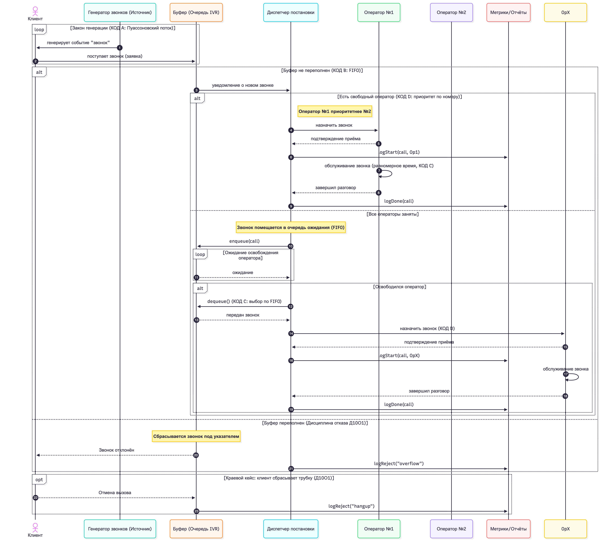
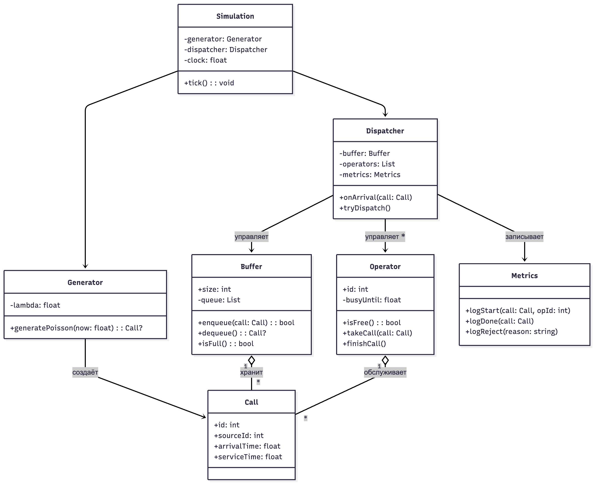
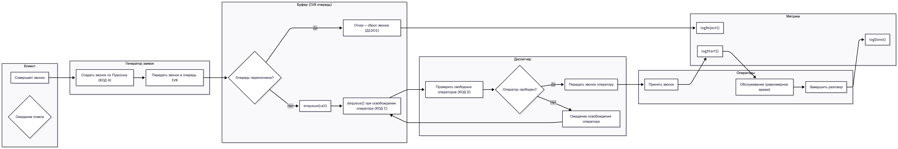

# Контакт-центр службы доставки

Симуляция работы контакт-центра службы доставки с использованием системы массового обслуживания.

## Установка зависимостей

```bash
pip install -r requirements.txt
```

## Запуск

```bash
python -m app
```

## Первичные артефакты

1. Сиквенс-диаграмма
    
    
    

1. Диаграмма классов
    
    
    
2. Flowchart с дорожками
    
    
